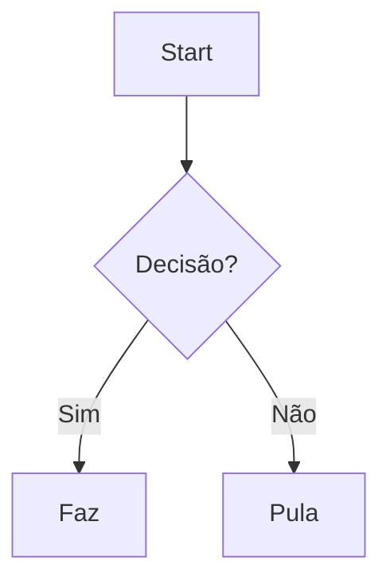
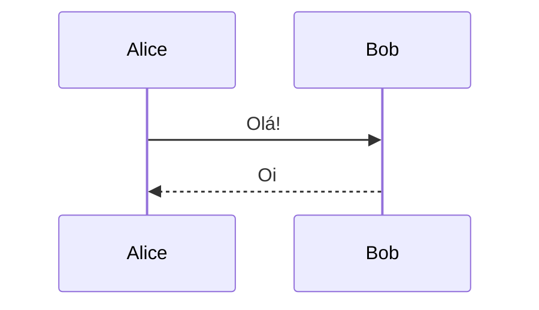
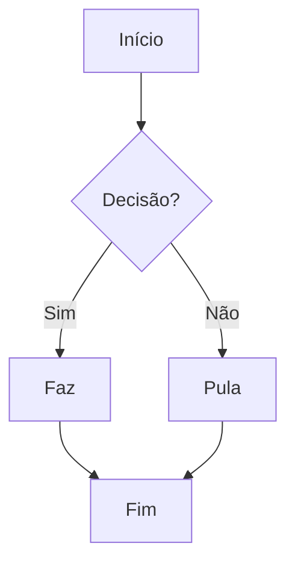
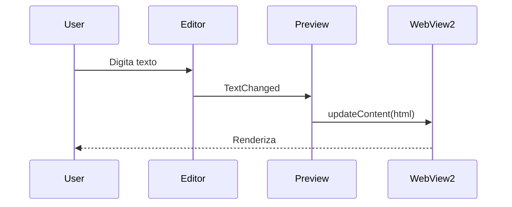

# v1.8.0 Implementation Plan

> **For agentic workers:** REQUIRED SUB-SKILL: Use superpowers:subagent-driven-development (recommended) or superpowers:executing-plans to implement this plan task-by-task. Steps use checkbox (`- [ ]`) syntax for tracking.

**Goal:** Entregar a release v1.8.0 com wiki-links `[[...]]`, diagramas Mermaid, fórmulas KaTeX, fix do bug de heading anchor em links `mdnav://`, e atualização sincronizada de CHANGELOG/README/wiki.

**Architecture:** Markdig pipeline ganha extensão `WikiLinkExtension` + `UseMathematics()`. Preview HTML embute Mermaid e KaTeX (libs como `EmbeddedResource`). Resolução de wiki-links usa índice cacheado em `WorkspaceService`, invalidado pelo `FileSystemWatcher` existente. AvalonEdit ganha autocomplete via `CompletionWindow` ao digitar `[[`. Bug de fragment em `mdnav://` é corrigido separando `path` e `fragment` em query params distintos.

**Tech Stack:** .NET 10 WPF, Markdig 1.1.1, AvalonEdit 6.3.1.120, WebView2 1.0.3800, xUnit 2.9.3, Mermaid 11.4.0, KaTeX 0.16.11.

**Spec:** [docs/specs/2026-05-19-v1.8.0-design.md](../specs/2026-05-19-v1.8.0-design.md)

**Segurança do preview:** o app já configura Markdig com `.DisableHtml()`, que rejeita raw HTML/script no source markdown. O `updateContent(html)` que atribui ao `content` element (linha existente em `preview-template.html`) recebe apenas HTML gerado pelo Markdig — não input arbitrário do usuário. Mantemos esse modelo no plano abaixo.

---

## Fase 0 — Preparação

### Task 0.1: Validar baseline (build + testes existentes verdes)

**Files:**
- Read: `src/MeuMarkdown/MeuMarkdown.csproj`
- Read: `tests/MeuMarkdown.Tests/MeuMarkdown.Tests.csproj`

- [ ] **Step 1: Confirmar que build limpo passa**

Run:
```powershell
rtk dotnet build src/MeuMarkdown/MeuMarkdown.csproj -c Debug
```

Expected: `Compilação bem-sucedida` sem warnings críticos.

- [ ] **Step 2: Confirmar que suite de testes está verde antes de tocar em nada**

Run:
```powershell
rtk dotnet test tests/MeuMarkdown.Tests/MeuMarkdown.Tests.csproj
```

Expected: todos passam. Anote o número de testes para comparar no final.

- [ ] **Step 3: Confirmar branch limpa**

Run:
```powershell
rtk git status
```

Expected: apenas `.claude/settings.json` untracked (ignorar).

---

## Fase 1 — Fix do bug `#heading` em `mdnav://`

Pré-requisito de `[[Arquivo#heading]]` e bug histórico afetando `[texto](arquivo.md#heading)`.

### Task 1.1: Reescrever `RewriteRelativeLinks` separando path e fragment

**Files:**
- Modify: `src/MeuMarkdown/Services/MarkdownService.cs:114-127`
- Test: `tests/MeuMarkdown.Tests/Services/MarkdownServiceTests.cs`

- [ ] **Step 1: Adicionar testes do comportamento novo**

Em `tests/MeuMarkdown.Tests/Services/MarkdownServiceTests.cs`, adicionar no final:

```csharp
[Fact]
public void ConvertToHtml_LinkWithoutFragment_EmitsPathOnly()
{
    var service = new MarkdownService();
    var md = "[ver](arquivo.md)";

    var html = service.ConvertToHtmlFragment(md, baseDirectory: "C:\\docs");

    Assert.Contains("mdnav://open?path=arquivo.md", html);
    Assert.DoesNotContain("fragment=", html);
}

[Fact]
public void ConvertToHtml_LinkWithFragment_EmitsPathAndFragmentSeparately()
{
    var service = new MarkdownService();
    var md = "[ver](arquivo.md#secao)";

    var html = service.ConvertToHtmlFragment(md, baseDirectory: "C:\\docs");

    Assert.Contains("path=arquivo.md", html);
    Assert.Contains("fragment=secao", html);
    Assert.DoesNotContain("path=arquivo.md%23", html);
    Assert.DoesNotContain("path=arquivo.md#", html);
}

[Fact]
public void ConvertToHtml_LinkWithFragmentContainingSpecialChars_EncodesCorrectly()
{
    var service = new MarkdownService();
    var md = "[ver](arquivo.md#seção-com-acento)";

    var html = service.ConvertToHtmlFragment(md, baseDirectory: "C:\\docs");

    Assert.Contains("path=arquivo.md", html);
    Assert.Contains("fragment=", html);
}
```

- [ ] **Step 2: Rodar — esperando 2 falhas**

Run:
```powershell
rtk dotnet test tests/MeuMarkdown.Tests/MeuMarkdown.Tests.csproj --filter MarkdownServiceTests
```

Expected: o primeiro teste PASS, os outros 2 FAIL.

- [ ] **Step 3: Reescrever `RewriteRelativeLinks`**

Em `src/MeuMarkdown/Services/MarkdownService.cs:114-127`, substituir o método inteiro por:

```csharp
private static string RewriteRelativeLinks(string html, string baseDirectory)
{
    // Reescreve hrefs relativos terminando em .md (com fragment opcional) para
    // o scheme mdnav://. Path e fragment ficam em query params distintos para
    // que o handler de clique consiga separá-los sem ambiguidade.
    return System.Text.RegularExpressions.Regex.Replace(
        html,
        @"href=""(?!https?://)(?!mailto:)(?!#)([^""#]*\.md)(?:#([^""]*))?""",
        match =>
        {
            var path = match.Groups[1].Value;
            var fragment = match.Groups[2].Success ? match.Groups[2].Value : null;
            var encodedPath = Uri.EscapeDataString(path);
            if (string.IsNullOrEmpty(fragment))
                return $@"href=""mdnav://open?path={encodedPath}""";
            var encodedFragment = Uri.EscapeDataString(fragment);
            return $@"href=""mdnav://open?path={encodedPath}&fragment={encodedFragment}""";
        });
}
```

- [ ] **Step 4: Rodar os testes — 3/3 verdes**

Run:
```powershell
rtk dotnet test tests/MeuMarkdown.Tests/MeuMarkdown.Tests.csproj --filter MarkdownServiceTests
```

- [ ] **Step 5: Commit**

Run:
```powershell
rtk git add src/MeuMarkdown/Services/MarkdownService.cs tests/MeuMarkdown.Tests/Services/MarkdownServiceTests.cs
rtk git commit -m "fix(mdnav): separa path e fragment em query params distintos"
```

### Task 1.2: Atualizar `MarkdownPreview` para emitir fragment no `LinkClicked`

**Files:**
- Modify: `src/MeuMarkdown/Controls/MarkdownPreview.xaml.cs:15` (assinatura do evento)
- Modify: `src/MeuMarkdown/Controls/MarkdownPreview.xaml.cs:259-270` (handler de `mdnav://`)

- [ ] **Step 1: Trocar assinatura do evento `LinkClicked`**

Em `src/MeuMarkdown/Controls/MarkdownPreview.xaml.cs:15`, substituir:

```csharp
public event Action<string>? LinkClicked;
```

por:

```csharp
public event Action<string, string?>? LinkClicked;
```

- [ ] **Step 2: Atualizar o handler `OnNavigationStarting`**

Em `src/MeuMarkdown/Controls/MarkdownPreview.xaml.cs:259-270`, substituir o bloco do `mdnav://` por:

```csharp
if (uri.StartsWith("mdnav://", StringComparison.OrdinalIgnoreCase))
{
    e.Cancel = true;
    var queryString = new Uri(uri).Query;
    var qs = HttpUtility.ParseQueryString(queryString);
    var path = qs["path"];
    var fragment = qs["fragment"];
    if (!string.IsNullOrEmpty(path))
    {
        var decodedPath = Uri.UnescapeDataString(path);
        var decodedFragment = string.IsNullOrEmpty(fragment)
            ? null
            : Uri.UnescapeDataString(fragment);
        LinkClicked?.Invoke(decodedPath, decodedFragment);
    }
    return;
}
```

- [ ] **Step 3: Build — esperando erro em quem consome `LinkClicked`**

Run:
```powershell
rtk dotnet build src/MeuMarkdown/MeuMarkdown.csproj -c Debug
```

Expected: erro em `MainWindow.xaml.cs:478` (handler não bate). Próxima task corrige.

### Task 1.3: Atualizar `NavigationService`, `MainViewModel` e `MainWindow.OnPreviewLinkClicked`

**Files:**
- Modify: `src/MeuMarkdown/Services/NavigationService.cs` (arquivo inteiro)
- Modify: `src/MeuMarkdown/ViewModels/MainViewModel.cs:248-251`
- Modify: `src/MeuMarkdown/ViewModels/MainViewModel.cs` (adicionar property)
- Modify: `src/MeuMarkdown/MainWindow.xaml.cs:478-482`

- [ ] **Step 1: Substituir `NavigationService.cs` inteiro**

Conteúdo novo de `src/MeuMarkdown/Services/NavigationService.cs`:

```csharp
using MeuMarkdown.Models;

namespace MeuMarkdown.Services;

public class NavigationService
{
    private readonly FileService _fileService;
    private readonly NavigationHistory _history = new();

    public NavigationHistory History => _history;

    /// <summary>
    /// Disparado quando uma navegação é solicitada. O segundo parâmetro é o
    /// fragment (heading sem `#`) opcional — null quando o link não tem âncora.
    /// </summary>
    public event Action<string, string?>? NavigationRequested;

    public NavigationService(FileService fileService)
    {
        _fileService = fileService;
    }

    public void NavigateTo(string filePath, string currentDirectory, string? fragment = null)
    {
        var resolvedPath = _fileService.ResolvePath(filePath, currentDirectory);
        if (!_fileService.FileExists(resolvedPath)) return;

        _history.Navigate(resolvedPath);
        NavigationRequested?.Invoke(resolvedPath, fragment);
    }

    public void GoBack()
    {
        var path = _history.GoBack();
        if (path != null)
            NavigationRequested?.Invoke(path, null);
    }

    public void GoForward()
    {
        var path = _history.GoForward();
        if (path != null)
            NavigationRequested?.Invoke(path, null);
    }
}
```

- [ ] **Step 2: Adicionar `PendingScrollFragment` property no `MainViewModel`**

Em `src/MeuMarkdown/ViewModels/MainViewModel.cs`, perto dos outros `[ObservableProperty]` (após linha ~49):

```csharp
[ObservableProperty]
private string? _pendingScrollFragment;
```

- [ ] **Step 3: Atualizar `OnNavigationRequested`**

Em `src/MeuMarkdown/ViewModels/MainViewModel.cs:248-251`, substituir:

```csharp
private void OnNavigationRequested(string filePath)
{
    OpenFileByPath(filePath);
}
```

por:

```csharp
private void OnNavigationRequested(string filePath, string? fragment)
{
    OpenFileByPath(filePath);
    PendingScrollFragment = fragment;
}
```

- [ ] **Step 4: Atualizar `OnPreviewLinkClicked` no `MainWindow`**

Em `src/MeuMarkdown/MainWindow.xaml.cs:478-482`, substituir:

```csharp
private void OnPreviewLinkClicked(string relativePath)
{
    if (_viewModel.SelectedTab == null) return;
    _viewModel.Navigation.NavigateTo(relativePath, _viewModel.SelectedTab.Directory);
}
```

por:

```csharp
private void OnPreviewLinkClicked(string relativePath, string? fragment)
{
    if (_viewModel.SelectedTab == null) return;
    _viewModel.Navigation.NavigateTo(relativePath, _viewModel.SelectedTab.Directory, fragment);
}
```

- [ ] **Step 5: Build — zero erros**

Run:
```powershell
rtk dotnet build src/MeuMarkdown/MeuMarkdown.csproj -c Debug
```

- [ ] **Step 6: Commit**

Run:
```powershell
rtk git add src/MeuMarkdown/Controls/MarkdownPreview.xaml.cs src/MeuMarkdown/Services/NavigationService.cs src/MeuMarkdown/ViewModels/MainViewModel.cs src/MeuMarkdown/MainWindow.xaml.cs
rtk git commit -m "feat(nav): NavigationService aceita fragment opcional"
```

### Task 1.4: Reagir ao `PendingScrollFragment` para scrollar até o heading

**Files:**
- Modify: `src/MeuMarkdown/MainWindow.xaml.cs` (na função que reage a `SelectedTab` change ou ao update do preview)

- [ ] **Step 1: Localizar o ponto onde tab change atualiza o editor**

Run Grep:

```
Grep "SelectedTab" no MainWindow.xaml.cs com output_mode=content -C 5
```

Identificar a função que (a) carrega `tab.Content` no `textEditor.Text` ou (b) atualiza o preview ao trocar de aba. Normalmente é um `OnSelectedTabChanged` ou similar.

- [ ] **Step 2: Adicionar reação ao `PendingScrollFragment`**

No final da função que atualiza o preview após tab change (depois de `preview.UpdateContentFragment(html)` ou similar), adicionar:

```csharp
// Se chegou aqui via wiki-link com fragment, scrolla até o heading correspondente.
if (!string.IsNullOrEmpty(_viewModel.PendingScrollFragment))
{
    var fragment = _viewModel.PendingScrollFragment;
    _viewModel.PendingScrollFragment = null;

    // Aguarda o próximo idle para garantir que o Outline já foi atualizado.
    Dispatcher.BeginInvoke(System.Windows.Threading.DispatcherPriority.Background, () =>
    {
        var tab = _viewModel.SelectedTab;
        if (tab == null) return;
        var heading = tab.Headings.FirstOrDefault(h =>
            string.Equals(h.AnchorId, fragment, StringComparison.OrdinalIgnoreCase));
        if (heading != null)
        {
            OnOutlineHeadingSelected(this, heading);
        }
    });
}
```

- [ ] **Step 3: Build**

Run:
```powershell
rtk dotnet build src/MeuMarkdown/MeuMarkdown.csproj -c Debug
```

- [ ] **Step 4: Smoke test manual**

```powershell
New-Item -ItemType Directory -Force D:\tmp\test-fragment | Out-Null
Set-Content D:\tmp\test-fragment\a.md @'
# A
Veja [seção da B](b.md#seção-importante).
'@
Set-Content D:\tmp\test-fragment\b.md @'
# B
texto

## Seção importante
conteúdo
'@

rtk dotnet run --project src/MeuMarkdown/MeuMarkdown.csproj -- D:\tmp\test-fragment\a.md
```

Clicar no link no preview. Expected: abre `b.md` E o editor scrolla até "Seção importante".

- [ ] **Step 5: Commit**

Run:
```powershell
rtk git add src/MeuMarkdown/MainWindow.xaml.cs
rtk git commit -m "feat(nav): scrolla ate heading apos navegar via mdnav com fragment"
```

---

## Fase 2 — KaTeX no preview

### Task 2.1: Baixar KaTeX e gerar `katex.min.css` com fonts inline

**Files:**
- Create: `scripts/inline-katex-fonts.ps1`
- Create: `src/MeuMarkdown/Resources/katex.min.js`
- Create: `src/MeuMarkdown/Resources/katex.min.css` (após processado)
- Create: `src/MeuMarkdown/Resources/katex-auto-render.min.js`

- [ ] **Step 1: Baixar release 0.16.11 do KaTeX**

Run:
```powershell
New-Item -ItemType Directory -Force C:\Users\adriano\AppData\Local\Temp\katex-dl | Out-Null
Invoke-WebRequest -Uri "https://github.com/KaTeX/KaTeX/releases/download/v0.16.11/katex.tar.gz" -OutFile "C:\Users\adriano\AppData\Local\Temp\katex-dl\katex.tar.gz"
tar -xzf C:\Users\adriano\AppData\Local\Temp\katex-dl\katex.tar.gz -C C:\Users\adriano\AppData\Local\Temp\katex-dl
```

Expected: pasta `katex/` extraída com `katex.min.js`, `katex.min.css`, `fonts/`, `contrib/auto-render.min.js`.

- [ ] **Step 2: Copiar arquivos JS para Resources**

Run:
```powershell
Copy-Item C:\Users\adriano\AppData\Local\Temp\katex-dl\katex\katex.min.js src\MeuMarkdown\Resources\katex.min.js
Copy-Item C:\Users\adriano\AppData\Local\Temp\katex-dl\katex\contrib\auto-render.min.js src\MeuMarkdown\Resources\katex-auto-render.min.js
```

- [ ] **Step 3: Criar o script `scripts/inline-katex-fonts.ps1`**

Conteúdo completo:

```powershell
# Inline KaTeX fonts as data: URLs in katex.min.css.
# Reads the original katex.min.css and fonts/ from a source directory,
# emits a single CSS file with fonts embedded.
#
# Usage:
#   .\scripts\inline-katex-fonts.ps1 -SourceDir <katex-folder> -Out <output.css>

param(
    [Parameter(Mandatory=$true)][string]$SourceDir,
    [Parameter(Mandatory=$true)][string]$Out
)

$cssPath = Join-Path $SourceDir 'katex.min.css'
$fontsDir = Join-Path $SourceDir 'fonts'

if (-not (Test-Path $cssPath)) { throw "katex.min.css not found at $cssPath" }
if (-not (Test-Path $fontsDir)) { throw "fonts/ not found at $fontsDir" }

$css = Get-Content $cssPath -Raw

# Inline url(fonts/*.woff2) as data: URL.
$pattern = 'url\(fonts/([^)]+\.woff2)\)'
$css = [regex]::Replace($css, $pattern, {
    param($m)
    $fontFile = Join-Path $fontsDir $m.Groups[1].Value
    if (-not (Test-Path $fontFile)) { return $m.Value }
    $bytes = [IO.File]::ReadAllBytes($fontFile)
    $b64 = [Convert]::ToBase64String($bytes)
    "url(data:font/woff2;base64,$b64)"
})

# Drop url(fonts/*.woff) and url(fonts/*.ttf) (older formats — WOFF2 suffices).
$css = [regex]::Replace($css, 'url\(fonts/[^)]+\.(woff|ttf)\)\s*format\([^)]+\),?\s*', '')

Set-Content -Path $Out -Value $css -Encoding UTF8
Write-Host "Generated $Out ($($css.Length) bytes)"
```

- [ ] **Step 4: Executar o script**

Run:
```powershell
.\scripts\inline-katex-fonts.ps1 -SourceDir C:\Users\adriano\AppData\Local\Temp\katex-dl\katex -Out src\MeuMarkdown\Resources\katex.min.css
```

Expected: `Generated src\MeuMarkdown\Resources\katex.min.css (N bytes)` com N ~250-300KB.

- [ ] **Step 5: Validar que não sobrou referência a `fonts/` no CSS**

Run:
```powershell
Select-String -Path src\MeuMarkdown\Resources\katex.min.css -Pattern 'url\(fonts/' -SimpleMatch
```

Expected: nenhum match.

- [ ] **Step 6: Commit dos recursos KaTeX**

Run:
```powershell
rtk git add scripts/inline-katex-fonts.ps1 src/MeuMarkdown/Resources/katex.min.js src/MeuMarkdown/Resources/katex.min.css src/MeuMarkdown/Resources/katex-auto-render.min.js
rtk git commit -m "build(katex): embarca KaTeX 0.16.11 com fonts inline"
```

### Task 2.2: Registrar recursos KaTeX no `.csproj`

**Files:**
- Modify: `src/MeuMarkdown/MeuMarkdown.csproj:26-30`

- [ ] **Step 1: Adicionar EmbeddedResource entries**

Em `src/MeuMarkdown/MeuMarkdown.csproj`, no ItemGroup que contém EmbeddedResource (linhas 26-30), substituir o bloco por:

```xml
<ItemGroup>
  <EmbeddedResource Include="Resources\preview-template.html" />
  <EmbeddedResource Include="Resources\github-markdown.css" />
  <EmbeddedResource Include="Resources\markdown-syntax.xshd" />
  <EmbeddedResource Include="Resources\katex.min.js" />
  <EmbeddedResource Include="Resources\katex.min.css" />
  <EmbeddedResource Include="Resources\katex-auto-render.min.js" />
</ItemGroup>
```

- [ ] **Step 2: Build**

Run:
```powershell
rtk dotnet build src/MeuMarkdown/MeuMarkdown.csproj -c Debug
```

- [ ] **Step 3: Commit**

Run:
```powershell
rtk git add src/MeuMarkdown/MeuMarkdown.csproj
rtk git commit -m "build(katex): registra recursos como EmbeddedResource"
```

### Task 2.3: Habilitar `UseMathematics()` no Markdig

**Files:**
- Modify: `src/MeuMarkdown/Services/MarkdownService.cs:19-25`
- Test: `tests/MeuMarkdown.Tests/Services/MarkdownServiceTests.cs`

- [ ] **Step 1: Adicionar testes**

Em `MarkdownServiceTests.cs`, adicionar:

```csharp
[Fact]
public void ConvertToHtml_InlineMath_GeneratesMathSpan()
{
    var service = new MarkdownService();
    var md = "A fórmula $E=mc^2$ é famosa.";

    var html = service.ConvertToHtmlFragment(md, baseDirectory: "C:\\docs");

    Assert.Contains("math", html);
}

[Fact]
public void ConvertToHtml_BlockMath_GeneratesMathDiv()
{
    var service = new MarkdownService();
    var md = "$$\n\\int_0^\\infty e^{-x} dx\n$$";

    var html = service.ConvertToHtmlFragment(md, baseDirectory: "C:\\docs");

    Assert.Contains("math", html);
}
```

- [ ] **Step 2: Rodar — 2 FAIL**

Run:
```powershell
rtk dotnet test tests/MeuMarkdown.Tests/MeuMarkdown.Tests.csproj --filter MarkdownServiceTests
```

- [ ] **Step 3: Adicionar `.UseMathematics()` no pipeline**

Em `src/MeuMarkdown/Services/MarkdownService.cs:19-25`, substituir:

```csharp
_pipeline = new MarkdownPipelineBuilder()
    .UseAdvancedExtensions()
    .UseAutoIdentifiers()
    .UseTaskLists()
    .UseAutoLinks()
    .DisableHtml()
    .Build();
```

por:

```csharp
_pipeline = new MarkdownPipelineBuilder()
    .UseAdvancedExtensions()
    .UseAutoIdentifiers()
    .UseTaskLists()
    .UseAutoLinks()
    .UseMathematics()
    .DisableHtml()
    .Build();
```

- [ ] **Step 4: Rodar testes — todos PASS**

Run:
```powershell
rtk dotnet test tests/MeuMarkdown.Tests/MeuMarkdown.Tests.csproj --filter MarkdownServiceTests
```

- [ ] **Step 5: Commit**

Run:
```powershell
rtk git add src/MeuMarkdown/Services/MarkdownService.cs tests/MeuMarkdown.Tests/Services/MarkdownServiceTests.cs
rtk git commit -m "feat(markdig): habilita Mathematics extension para KaTeX"
```

### Task 2.4: Injetar KaTeX no `preview-template.html`

**Files:**
- Modify: `src/MeuMarkdown/Resources/preview-template.html`
- Modify: `src/MeuMarkdown/Services/MarkdownService.cs`

- [ ] **Step 1: Adicionar placeholder de CSS no template**

Em `src/MeuMarkdown/Resources/preview-template.html`, logo após a linha `<style>{{CSS}}</style>` (linha 7), inserir nova linha:

```html
<style>{{KATEX_CSS}}</style>
```

- [ ] **Step 2: Adicionar scripts KaTeX antes do `<script>` existente**

Em `src/MeuMarkdown/Resources/preview-template.html`, antes de `<script>` (linha ~110), inserir:

```html
<script>{{KATEX_JS}}</script>
<script>{{KATEX_AUTO_RENDER_JS}}</script>
```

- [ ] **Step 3: Adicionar função `renderEnhancements` e tornar `updateContent` async**

Em `src/MeuMarkdown/Resources/preview-template.html`, dentro do `<script>` existente, ANTES da função `updateContent` (linha ~111), inserir:

```js
async function renderEnhancements() {
    // KaTeX: aplica auto-render nos elementos com classe math (gerados pelo Markdig).
    if (window.renderMathInElement) {
        renderMathInElement(document.body, {
            delimiters: [
                { left: '$$', right: '$$', display: true },
                { left: '$',  right: '$',  display: false }
            ],
            throwOnError: false
        });
    }
}
```

Em seguida, modificar a função `updateContent` existente (linha ~111-113) para chamar `renderEnhancements` ao final. A função atual é:

```js
function updateContent(html) {
    document.getElementById('content').innerHTML = html;
}
```

A linha que atribui o HTML permanece — é alimentada pelo `MarkdownService` que tem `.DisableHtml()` (raw HTML bloqueado no source markdown). Adicionar `async` na assinatura e `await renderEnhancements();` na linha seguinte. Diff:

```diff
-function updateContent(html) {
-    document.getElementById('content').innerHTML = html;
-}
+async function updateContent(html) {
+    document.getElementById('content').innerHTML = html;
+    await renderEnhancements();
+}
```

- [ ] **Step 4: Atualizar `MarkdownService` para substituir os 3 novos placeholders**

Em `src/MeuMarkdown/Services/MarkdownService.cs`, na classe `MarkdownService`:

Adicionar fields perto dos existentes (linhas 13-16):

```csharp
private readonly string _katexJs;
private readonly string _katexCss;
private readonly string _katexAutoRenderJs;
```

No ctor, carregar os recursos (após `_css = ...`):

```csharp
_katexJs           = LoadEmbeddedResource("MeuMarkdown.Resources.katex.min.js");
_katexCss          = LoadEmbeddedResource("MeuMarkdown.Resources.katex.min.css");
_katexAutoRenderJs = LoadEmbeddedResource("MeuMarkdown.Resources.katex-auto-render.min.js");
```

Atualizar `ConvertToHtml` (linhas 31-38) — substituir o `return` por:

```csharp
return _htmlTemplate
    .Replace("{{CSS}}", _css)
    .Replace("{{KATEX_CSS}}", _katexCss)
    .Replace("{{KATEX_JS}}", _katexJs)
    .Replace("{{KATEX_AUTO_RENDER_JS}}", _katexAutoRenderJs)
    .Replace("{{CONTENT}}", html);
```

- [ ] **Step 5: Build**

Run:
```powershell
rtk dotnet build src/MeuMarkdown/MeuMarkdown.csproj -c Debug
```

- [ ] **Step 6: Smoke test KaTeX**

```powershell
Set-Content D:\tmp\katex-test.md @'
# Teste KaTeX

Inline: $E = mc^2$ no meio do texto.

Bloco:

$$
\int_0^\infty e^{-x^2} dx = \frac{\sqrt{\pi}}{2}
$$

Inválido: $\notarealcommand{foo}$
'@
rtk dotnet run --project src/MeuMarkdown/MeuMarkdown.csproj -- D:\tmp\katex-test.md
```

Expected:
- `E = mc^2` aparece com fonte matemática
- Integral aparece em bloco centralizado
- Fórmula inválida aparece em vermelho

- [ ] **Step 7: Commit**

Run:
```powershell
rtk git add src/MeuMarkdown/Resources/preview-template.html src/MeuMarkdown/Services/MarkdownService.cs
rtk git commit -m "feat(preview): integra KaTeX no template"
```

---

## Fase 3 — Mermaid no preview

### Task 3.1: Baixar Mermaid e registrar como recurso

**Files:**
- Create: `src/MeuMarkdown/Resources/mermaid.min.js`
- Modify: `src/MeuMarkdown/MeuMarkdown.csproj`

- [ ] **Step 1: Baixar Mermaid 11.4.0**

Run:
```powershell
Invoke-WebRequest -Uri "https://cdn.jsdelivr.net/npm/mermaid@11.4.0/dist/mermaid.min.js" -OutFile "src\MeuMarkdown\Resources\mermaid.min.js"
(Get-Item src\MeuMarkdown\Resources\mermaid.min.js).Length
```

Expected: ~650-700KB.

- [ ] **Step 2: Registrar como EmbeddedResource**

Em `src/MeuMarkdown/MeuMarkdown.csproj`, adicionar no ItemGroup de EmbeddedResource:

```xml
<EmbeddedResource Include="Resources\mermaid.min.js" />
```

- [ ] **Step 3: Build**

Run:
```powershell
rtk dotnet build src/MeuMarkdown/MeuMarkdown.csproj -c Debug
```

- [ ] **Step 4: Commit**

Run:
```powershell
rtk git add src/MeuMarkdown/Resources/mermaid.min.js src/MeuMarkdown/MeuMarkdown.csproj
rtk git commit -m "build(mermaid): embarca Mermaid 11.4.0"
```

### Task 3.2: Integrar Mermaid no template

**Files:**
- Modify: `src/MeuMarkdown/Resources/preview-template.html`
- Modify: `src/MeuMarkdown/Services/MarkdownService.cs`

- [ ] **Step 1: Adicionar script tag e bootstrap do Mermaid no template**

Em `src/MeuMarkdown/Resources/preview-template.html`, antes dos scripts KaTeX (que foram adicionados na Task 2.4), inserir:

```html
<script>{{MERMAID_JS}}</script>
<script>
    if (window.mermaid) {
        mermaid.initialize({
            startOnLoad: false,
            theme: 'default',
            securityLevel: 'strict'
        });
    }
</script>
```

- [ ] **Step 2: Atualizar `renderEnhancements()` para processar Mermaid**

Em `src/MeuMarkdown/Resources/preview-template.html`, substituir a função `renderEnhancements` (adicionada na Task 2.4) por:

```js
async function renderEnhancements() {
    // Mermaid: detecta <pre><code class="language-mermaid"> e substitui por
    // <div class="mermaid"> antes de chamar mermaid.run.
    document.querySelectorAll('pre code.language-mermaid').forEach(el => {
        const div = document.createElement('div');
        div.className = 'mermaid';
        div.textContent = el.textContent;
        div.setAttribute('data-source', el.textContent);
        const pre = el.closest('pre');
        if (pre) pre.replaceWith(div); else el.replaceWith(div);
    });
    if (window.mermaid) {
        try { await mermaid.run({ querySelector: '.mermaid' }); }
        catch (e) { /* Mermaid renderiza box de erro inline */ }
    }

    // KaTeX: aplica auto-render nos elementos com classe math.
    if (window.renderMathInElement) {
        renderMathInElement(document.body, {
            delimiters: [
                { left: '$$', right: '$$', display: true },
                { left: '$',  right: '$',  display: false }
            ],
            throwOnError: false
        });
    }
}
```

- [ ] **Step 3: Atualizar `setTheme()` para re-aplicar tema do Mermaid**

Em `src/MeuMarkdown/Resources/preview-template.html`, na função `setTheme` (linha ~114), substituir por:

```js
async function setTheme(dark) {
    document.body.className = dark ? 'dark' : '';
    if (window.mermaid) {
        mermaid.initialize({
            startOnLoad: false,
            theme: dark ? 'dark' : 'default',
            securityLevel: 'strict'
        });
        // Re-renderiza diagramas já processados com a nova paleta.
        document.querySelectorAll('.mermaid').forEach(el => {
            el.removeAttribute('data-processed');
            const original = el.getAttribute('data-source') ?? el.textContent;
            el.textContent = original;
        });
        try { await mermaid.run({ querySelector: '.mermaid' }); } catch (e) {}
    }
}
```

- [ ] **Step 4: Substituir placeholder `{{MERMAID_JS}}` no `MarkdownService`**

Em `src/MeuMarkdown/Services/MarkdownService.cs`:

Adicionar field:

```csharp
private readonly string _mermaidJs;
```

No ctor:

```csharp
_mermaidJs = LoadEmbeddedResource("MeuMarkdown.Resources.mermaid.min.js");
```

No `ConvertToHtml`, adicionar mais um `.Replace`:

```csharp
return _htmlTemplate
    .Replace("{{CSS}}", _css)
    .Replace("{{KATEX_CSS}}", _katexCss)
    .Replace("{{KATEX_JS}}", _katexJs)
    .Replace("{{KATEX_AUTO_RENDER_JS}}", _katexAutoRenderJs)
    .Replace("{{MERMAID_JS}}", _mermaidJs)
    .Replace("{{CONTENT}}", html);
```

- [ ] **Step 5: Build**

Run:
```powershell
rtk dotnet build src/MeuMarkdown/MeuMarkdown.csproj -c Debug
```

- [ ] **Step 6: Smoke test Mermaid**

```powershell
Set-Content D:\tmp\mermaid-test.md @'
# Teste Mermaid

Flowchart:



Sequence:



Inválido:

```mermaid
não é syntax válido
```
'@
rtk dotnet run --project src/MeuMarkdown/MeuMarkdown.csproj -- D:\tmp\mermaid-test.md
```

Expected:
- Flowchart e sequence desenhados
- Diagrama inválido mostra painel de erro
- F6 (toggle dark): paleta dos diagramas troca

- [ ] **Step 7: Commit**

Run:
```powershell
rtk git add src/MeuMarkdown/Resources/preview-template.html src/MeuMarkdown/Services/MarkdownService.cs
rtk git commit -m "feat(preview): integra Mermaid com tema dinamico"
```

---

## Fase 4 — PrintToPdfAsync espera render async

### Task 4.1: Aguardar `renderEnhancements()` antes do print

**Files:**
- Modify: `src/MeuMarkdown/Controls/MarkdownPreview.xaml.cs:130-179`

- [ ] **Step 1: Inserir await do JS antes do PrintToPdfAsync**

Em `src/MeuMarkdown/Controls/MarkdownPreview.xaml.cs`, dentro de `PrintToPdfAsync`, logo após `await tcs.Task;` (a espera de NavigationCompleted, linha ~146), inserir:

```csharp
// Aguarda Mermaid/KaTeX renderizarem antes de gerar o PDF.
await webView.CoreWebView2.ExecuteScriptAsync(
    "(async () => { if (typeof renderEnhancements === 'function') { await renderEnhancements(); } return 'done'; })()"
);
```

- [ ] **Step 2: Build**

Run:
```powershell
rtk dotnet build src/MeuMarkdown/MeuMarkdown.csproj -c Debug
```

- [ ] **Step 3: Smoke test export PDF**

Usando o `mermaid-test.md` da task anterior, no app:
1. Menu Arquivo → Exportar para PDF…
2. Salvar como `D:\tmp\mermaid-test.pdf`
3. Abrir o PDF e verificar: diagramas aparecem renderizados (não como source)

- [ ] **Step 4: Smoke test export HTML**

1. Menu Arquivo → Exportar para HTML…
2. Salvar como `D:\tmp\mermaid-test.html`
3. Abrir no browser — diagramas/fórmulas devem renderizar (libs JS embutidas)

- [ ] **Step 5: Verificar `ExportService` (se necessário)**

Read `src/MeuMarkdown/Services/ExportService.cs`. Se ele chama `_markdownService.ConvertToHtml`, está OK (template completo). Se chama versão "lite", atualizar para `ConvertToHtml` completo.

- [ ] **Step 6: Commit**

Run:
```powershell
rtk git add src/MeuMarkdown/Controls/MarkdownPreview.xaml.cs
rtk git commit -m "fix(export-pdf): aguarda renderEnhancements antes do snapshot"
```

---

## Fase 5 — Wiki-links: parser e renderer (Markdig)

### Task 5.1: Criar `WikiLinkInline` (AST node)

**Files:**
- Create: `src/MeuMarkdown/Services/Markdig/WikiLinkInline.cs`

- [ ] **Step 1: Criar o arquivo**

Conteúdo de `src/MeuMarkdown/Services/Markdig/WikiLinkInline.cs`:

```csharp
using Markdig.Syntax.Inlines;

namespace MeuMarkdown.Services.Markdig;

/// <summary>
/// AST node para wiki-links [[Arquivo]], [[Arquivo|Alias]], [[Arquivo#heading]].
/// Resolução do path real é feita pelo renderer.
/// </summary>
public class WikiLinkInline : Inline
{
    public required string Target { get; init; }
    public string? Fragment { get; init; }
    public required string DisplayText { get; init; }
}
```

- [ ] **Step 2: Build**

Run:
```powershell
rtk dotnet build src/MeuMarkdown/MeuMarkdown.csproj -c Debug
```

### Task 5.2: Criar `WikiLinkInlineParser`, `WikiLinkExtension`, `WikiLinkHtmlRenderer`

**Files:**
- Create: `src/MeuMarkdown/Services/Markdig/WikiLinkInlineParser.cs`
- Create: `src/MeuMarkdown/Services/Markdig/WikiLinkExtension.cs`
- Create: `src/MeuMarkdown/Services/Markdig/WikiLinkHtmlRenderer.cs`
- Create: `tests/MeuMarkdown.Tests/Services/Markdig/WikiLinkInlineParserTests.cs`

- [ ] **Step 1: Criar testes do parser**

Criar `tests/MeuMarkdown.Tests/Services/Markdig/WikiLinkInlineParserTests.cs`:

```csharp
using Markdig;
using Markdig.Syntax;
using Markdig.Syntax.Inlines;
using MeuMarkdown.Services.Markdig;
using Xunit;

namespace MeuMarkdown.Tests.Services.Markdig;

public class WikiLinkInlineParserTests
{
    private static MarkdownPipeline BuildPipeline()
    {
        return new MarkdownPipelineBuilder()
            .Use(new WikiLinkExtension())
            .Build();
    }

    private static WikiLinkInline? FirstWikiLink(string markdown)
    {
        var doc = global::Markdig.Markdown.Parse(markdown, BuildPipeline());
        foreach (var block in doc.Descendants<ParagraphBlock>())
        {
            if (block.Inline == null) continue;
            foreach (var inline in block.Inline)
            {
                if (inline is WikiLinkInline wl) return wl;
            }
        }
        return null;
    }

    [Fact]
    public void Parse_SimpleName_TargetIsName()
    {
        var wl = FirstWikiLink("Veja [[Foo]] aqui.");
        Assert.NotNull(wl);
        Assert.Equal("Foo", wl!.Target);
        Assert.Equal("Foo", wl.DisplayText);
        Assert.Null(wl.Fragment);
    }

    [Fact]
    public void Parse_WithAlias_DisplayTextIsAlias()
    {
        var wl = FirstWikiLink("Veja [[Foo|texto alternativo]] aqui.");
        Assert.NotNull(wl);
        Assert.Equal("Foo", wl!.Target);
        Assert.Equal("texto alternativo", wl.DisplayText);
        Assert.Null(wl.Fragment);
    }

    [Fact]
    public void Parse_WithFragment_FragmentExtracted()
    {
        var wl = FirstWikiLink("Veja [[Foo#secao]] aqui.");
        Assert.NotNull(wl);
        Assert.Equal("Foo", wl!.Target);
        Assert.Equal("secao", wl.Fragment);
    }

    [Fact]
    public void Parse_WithFragmentAndAlias_BothExtracted()
    {
        var wl = FirstWikiLink("Veja [[Foo#secao|alias]] aqui.");
        Assert.NotNull(wl);
        Assert.Equal("Foo", wl!.Target);
        Assert.Equal("secao", wl.Fragment);
        Assert.Equal("alias", wl.DisplayText);
    }

    [Fact]
    public void Parse_WithSlashPath_TargetIncludesPath()
    {
        var wl = FirstWikiLink("Veja [[Sub/Foo]] aqui.");
        Assert.NotNull(wl);
        Assert.Equal("Sub/Foo", wl!.Target);
    }

    [Fact]
    public void Parse_NotAWikiLink_SingleBracket_ReturnsNull()
    {
        var wl = FirstWikiLink("Veja [Foo] aqui.");
        Assert.Null(wl);
    }

    [Fact]
    public void Parse_EmptyBrackets_ReturnsNull()
    {
        var wl = FirstWikiLink("Veja [[]] aqui.");
        Assert.Null(wl);
    }

    [Fact]
    public void Parse_UnclosedWikiLink_ReturnsNull()
    {
        var wl = FirstWikiLink("Veja [[Foo aqui.");
        Assert.Null(wl);
    }
}
```

- [ ] **Step 2: Criar `WikiLinkInlineParser.cs`**

Conteúdo:

```csharp
using Markdig.Helpers;
using Markdig.Parsers;

namespace MeuMarkdown.Services.Markdig;

public class WikiLinkInlineParser : InlineParser
{
    public WikiLinkInlineParser()
    {
        OpeningCharacters = new[] { '[' };
    }

    public override bool Match(InlineProcessor processor, ref StringSlice slice)
    {
        if (slice.PeekChar() != '[') return false;
        if (slice.PeekChar(2) == '[') return false;

        var startPos = slice.Start;
        slice.NextChar();
        slice.NextChar();

        var sb = new System.Text.StringBuilder();
        while (true)
        {
            var c = slice.CurrentChar;
            if (c == '\0' || c == '\n') return ResetAndFail(slice, startPos);
            if (c == ']' && slice.PeekChar() == ']')
            {
                slice.NextChar();
                slice.NextChar();
                break;
            }
            if (c == '[' || c == ']') return ResetAndFail(slice, startPos);
            sb.Append(c);
            slice.NextChar();
        }

        var raw = sb.ToString().Trim();
        if (raw.Length == 0) return ResetAndFail(slice, startPos);

        string? alias = null;
        var pipeIdx = raw.IndexOf('|');
        if (pipeIdx >= 0)
        {
            alias = raw.Substring(pipeIdx + 1).Trim();
            raw = raw.Substring(0, pipeIdx).Trim();
        }

        string? fragment = null;
        var hashIdx = raw.IndexOf('#');
        if (hashIdx >= 0)
        {
            fragment = raw.Substring(hashIdx + 1).Trim();
            raw = raw.Substring(0, hashIdx).Trim();
        }

        if (raw.Length == 0) return ResetAndFail(slice, startPos);

        var displayText = !string.IsNullOrEmpty(alias) ? alias : raw;

        processor.Inline = new WikiLinkInline
        {
            Target = raw,
            Fragment = fragment,
            DisplayText = displayText,
            Span = new global::Markdig.Syntax.SourceSpan(
                processor.GetSourcePosition(startPos),
                processor.GetSourcePosition(slice.Start - 1)),
            Line = processor.LineIndex,
            Column = processor.GetSourcePosition(startPos)
        };
        return true;
    }

    private static bool ResetAndFail(StringSlice slice, int startPos)
    {
        slice.Start = startPos;
        return false;
    }
}
```

- [ ] **Step 3: Criar `WikiLinkExtension.cs`**

Conteúdo:

```csharp
using Markdig;
using Markdig.Renderers;

namespace MeuMarkdown.Services.Markdig;

public record WikiLinkResolution(string AbsolutePath, string DisplayName);

public class WikiLinkExtension : IMarkdownExtension
{
    private readonly Func<string, string?, WikiLinkResolution?>? _resolver;
    private readonly Func<string?> _currentFileDir;

    public WikiLinkExtension(
        Func<string, string?, WikiLinkResolution?>? resolver = null,
        Func<string?>? currentFileDir = null)
    {
        _resolver = resolver;
        _currentFileDir = currentFileDir ?? (() => null);
    }

    public void Setup(MarkdownPipelineBuilder pipeline)
    {
        if (!pipeline.InlineParsers.Contains<WikiLinkInlineParser>())
            pipeline.InlineParsers.Insert(0, new WikiLinkInlineParser());
    }

    public void Setup(MarkdownPipeline pipeline, IMarkdownRenderer renderer)
    {
        if (renderer is HtmlRenderer htmlRenderer
            && !htmlRenderer.ObjectRenderers.Contains<WikiLinkHtmlRenderer>())
        {
            htmlRenderer.ObjectRenderers.Add(new WikiLinkHtmlRenderer(_resolver, _currentFileDir));
        }
    }
}
```

- [ ] **Step 4: Criar `WikiLinkHtmlRenderer.cs`**

Conteúdo:

```csharp
using Markdig.Renderers;
using Markdig.Renderers.Html;

namespace MeuMarkdown.Services.Markdig;

public class WikiLinkHtmlRenderer : HtmlObjectRenderer<WikiLinkInline>
{
    private readonly Func<string, string?, WikiLinkResolution?>? _resolver;
    private readonly Func<string?> _currentFileDir;

    public WikiLinkHtmlRenderer(
        Func<string, string?, WikiLinkResolution?>? resolver,
        Func<string?> currentFileDir)
    {
        _resolver = resolver;
        _currentFileDir = currentFileDir;
    }

    protected override void Write(HtmlRenderer renderer, WikiLinkInline obj)
    {
        var resolved = _resolver?.Invoke(obj.Target, _currentFileDir());
        if (resolved == null)
        {
            renderer.Write("<span class=\"wikilink-broken\" title=\"Arquivo não encontrado\">");
            renderer.WriteEscape(obj.DisplayText);
            renderer.Write("</span>");
            return;
        }

        var encodedPath = Uri.EscapeDataString(resolved.AbsolutePath);
        var href = $"mdnav://open?path={encodedPath}";
        if (!string.IsNullOrEmpty(obj.Fragment))
        {
            href += "&fragment=" + Uri.EscapeDataString(obj.Fragment);
        }
        renderer.Write("<a href=\"");
        renderer.Write(href);
        renderer.Write("\" class=\"wikilink\">");
        renderer.WriteEscape(obj.DisplayText);
        renderer.Write("</a>");
    }
}
```

- [ ] **Step 5: Rodar testes do parser — todos PASS**

Run:
```powershell
rtk dotnet test tests/MeuMarkdown.Tests/MeuMarkdown.Tests.csproj --filter WikiLinkInlineParserTests
```

Expected: 8/8 PASS.

- [ ] **Step 6: Commit**

Run:
```powershell
rtk git add src/MeuMarkdown/Services/Markdig/ tests/MeuMarkdown.Tests/Services/Markdig/
rtk git commit -m "feat(markdig): WikiLinkExtension com parser + renderer + AST"
```

### Task 5.3: Testes do renderer

**Files:**
- Create: `tests/MeuMarkdown.Tests/Services/Markdig/WikiLinkHtmlRendererTests.cs`

- [ ] **Step 1: Criar testes**

Conteúdo:

```csharp
using Markdig;
using MeuMarkdown.Services.Markdig;
using Xunit;

namespace MeuMarkdown.Tests.Services.Markdig;

public class WikiLinkHtmlRendererTests
{
    private static string Render(
        string md,
        Func<string, string?, WikiLinkResolution?>? resolver = null,
        string? currentDir = null)
    {
        var pipeline = new MarkdownPipelineBuilder()
            .Use(new WikiLinkExtension(resolver, () => currentDir))
            .Build();
        return global::Markdig.Markdown.ToHtml(md, pipeline);
    }

    [Fact]
    public void Render_BrokenLink_EmitsSpanWithBrokenClass()
    {
        var html = Render("Veja [[Foo]] aqui.", resolver: (_, _) => null);

        Assert.Contains("<span class=\"wikilink-broken\"", html);
        Assert.Contains(">Foo</span>", html);
    }

    [Fact]
    public void Render_ResolvedLink_EmitsAnchorWithMdnavHref()
    {
        var resolver = (string target, string? _) =>
            target == "Foo" ? new WikiLinkResolution("C:\\workspace\\Foo.md", "Foo") : null;
        var html = Render("Veja [[Foo]] aqui.", resolver);

        Assert.Contains("<a href=\"mdnav://open?path=", html);
        Assert.Contains("class=\"wikilink\"", html);
        Assert.Contains(">Foo</a>", html);
    }

    [Fact]
    public void Render_ResolvedWithFragment_HrefIncludesFragmentParam()
    {
        var resolver = (string target, string? _) =>
            target == "Foo" ? new WikiLinkResolution("C:\\workspace\\Foo.md", "Foo") : null;
        var html = Render("Veja [[Foo#secao]] aqui.", resolver);

        Assert.Contains("fragment=secao", html);
    }

    [Fact]
    public void Render_AliasOverridesDisplayText()
    {
        var resolver = (string target, string? _) =>
            target == "Foo" ? new WikiLinkResolution("C:\\workspace\\Foo.md", "Foo") : null;
        var html = Render("Veja [[Foo|texto alternativo]] aqui.", resolver);

        Assert.Contains(">texto alternativo</a>", html);
    }

    [Fact]
    public void Render_NullResolver_AllLinksBroken()
    {
        var html = Render("Veja [[Foo]] aqui.", resolver: null);

        Assert.Contains("wikilink-broken", html);
    }
}
```

- [ ] **Step 2: Rodar — 5/5 PASS**

Run:
```powershell
rtk dotnet test tests/MeuMarkdown.Tests/MeuMarkdown.Tests.csproj --filter WikiLinkHtmlRendererTests
```

- [ ] **Step 3: Commit**

Run:
```powershell
rtk git add tests/MeuMarkdown.Tests/Services/Markdig/WikiLinkHtmlRendererTests.cs
rtk git commit -m "test(wikilink): cobre renderer com resolver mockado"
```

---

## Fase 6 — Wiki-links: resolver no `WorkspaceService`

### Task 6.1: Adicionar `ResolveWikiLink`

**Files:**
- Modify: `src/MeuMarkdown/Services/WorkspaceService.cs`
- Modify: `tests/MeuMarkdown.Tests/Services/WorkspaceServiceTests.cs`

- [ ] **Step 1: Criar testes do resolver**

Em `tests/MeuMarkdown.Tests/Services/WorkspaceServiceTests.cs`, adicionar:

```csharp
[Fact]
public void ResolveWikiLink_SimpleName_FindsByFilename()
{
    var tmp = CreateTempWorkspace(("Foo.md", ""), ("Bar.md", ""));
    var ws = new WorkspaceService();
    ws.Open(tmp, showAllFiles: false);

    var result = ws.ResolveWikiLink("Foo", currentFileDir: tmp);

    Assert.NotNull(result);
    Assert.EndsWith("Foo.md", result!.AbsolutePath);
    Cleanup(tmp);
}

[Fact]
public void ResolveWikiLink_CaseInsensitive()
{
    var tmp = CreateTempWorkspace(("Foo.md", ""));
    var ws = new WorkspaceService();
    ws.Open(tmp, showAllFiles: false);

    var result = ws.ResolveWikiLink("foo", currentFileDir: tmp);

    Assert.NotNull(result);
    Cleanup(tmp);
}

[Fact]
public void ResolveWikiLink_NotFound_ReturnsNull()
{
    var tmp = CreateTempWorkspace(("Foo.md", ""));
    var ws = new WorkspaceService();
    ws.Open(tmp, showAllFiles: false);

    var result = ws.ResolveWikiLink("Inexistente", currentFileDir: tmp);

    Assert.Null(result);
    Cleanup(tmp);
}

[Fact]
public void ResolveWikiLink_PathWithSlash_ResolvesRelativeToCurrent()
{
    var tmp = CreateTempWorkspace(("Sub/Bar.md", ""));
    var ws = new WorkspaceService();
    ws.Open(tmp, showAllFiles: false);

    var result = ws.ResolveWikiLink("Sub/Bar", currentFileDir: tmp);

    Assert.NotNull(result);
    Assert.EndsWith("Bar.md", result!.AbsolutePath);
    Cleanup(tmp);
}

[Fact]
public void ResolveWikiLink_PathWithSlashAndMdExtension_Works()
{
    var tmp = CreateTempWorkspace(("Sub/Bar.md", ""));
    var ws = new WorkspaceService();
    ws.Open(tmp, showAllFiles: false);

    var result = ws.ResolveWikiLink("Sub/Bar.md", currentFileDir: tmp);

    Assert.NotNull(result);
    Cleanup(tmp);
}

[Fact]
public void ResolveWikiLink_MultipleCandidates_PrefersClosestByLca()
{
    var tmp = CreateTempWorkspace(
        ("area-a/sub/current.md", ""),
        ("area-a/Foo.md", ""),
        ("area-b/Foo.md", ""));
    var ws = new WorkspaceService();
    ws.Open(tmp, showAllFiles: false);

    var result = ws.ResolveWikiLink("Foo",
        currentFileDir: System.IO.Path.Combine(tmp, "area-a", "sub"));

    Assert.NotNull(result);
    Assert.Contains("area-a", result!.AbsolutePath);
    Assert.DoesNotContain("area-b", result.AbsolutePath);
    Cleanup(tmp);
}

[Fact]
public void ResolveWikiLink_NoWorkspaceOpen_ReturnsNull()
{
    var ws = new WorkspaceService();

    var result = ws.ResolveWikiLink("Foo", currentFileDir: null);

    Assert.Null(result);
}

private static string CreateTempWorkspace(params (string relPath, string content)[] files)
{
    var tmp = System.IO.Path.Combine(System.IO.Path.GetTempPath(),
        "mm-wiki-" + Guid.NewGuid().ToString("N").Substring(0, 8));
    System.IO.Directory.CreateDirectory(tmp);
    foreach (var (rel, content) in files)
    {
        var full = System.IO.Path.Combine(tmp,
            rel.Replace('/', System.IO.Path.DirectorySeparatorChar));
        System.IO.Directory.CreateDirectory(System.IO.Path.GetDirectoryName(full)!);
        System.IO.File.WriteAllText(full, content);
    }
    return tmp;
}

private static void Cleanup(string dir)
{
    try { System.IO.Directory.Delete(dir, recursive: true); } catch { }
}
```

Se a classe `WorkspaceServiceTests` não existir ainda, criar esqueleto:

```csharp
using MeuMarkdown.Services;
using Xunit;

namespace MeuMarkdown.Tests.Services;

public class WorkspaceServiceTests
{
    // (testes acima)
}
```

- [ ] **Step 2: Rodar — FAIL de compilação**

Run:
```powershell
rtk dotnet test tests/MeuMarkdown.Tests/MeuMarkdown.Tests.csproj --filter WorkspaceServiceTests
```

- [ ] **Step 3: Adicionar índice e método no `WorkspaceService`**

Em `src/MeuMarkdown/Services/WorkspaceService.cs`:

Adicionar `using`:

```csharp
using MeuMarkdown.Services.Markdig;
```

Adicionar fields (perto da linha 32):

```csharp
private Dictionary<string, List<string>>? _wikiLinkIndex;
private readonly object _wikiLinkLock = new();
```

Adicionar método (antes de `Dispose`):

```csharp
/// <summary>
/// Resolve um wiki-link target → path absoluto.
/// Regras detalhadas: docs/specs/2026-05-19-v1.8.0-design.md.
/// </summary>
public WikiLinkResolution? ResolveWikiLink(string target, string? currentFileDir)
{
    if (string.IsNullOrWhiteSpace(target)) return null;

    if (target.Contains('/') || target.Contains('\\'))
    {
        if (string.IsNullOrEmpty(currentFileDir)) return null;
        var relPath = target;
        if (!relPath.EndsWith(".md", StringComparison.OrdinalIgnoreCase))
            relPath += ".md";
        var fullPath = Path.GetFullPath(Path.Combine(currentFileDir, relPath));
        return File.Exists(fullPath)
            ? new WikiLinkResolution(fullPath, Path.GetFileNameWithoutExtension(fullPath))
            : null;
    }

    if (RootPath == null) return null;

    var index = GetOrBuildWikiLinkIndex();
    var key = target.ToLowerInvariant();
    if (!index.TryGetValue(key, out var candidates) || candidates.Count == 0)
        return null;

    if (candidates.Count == 1)
        return new WikiLinkResolution(candidates[0], target);

    var ranked = candidates
        .Select(p => new { Path = p, Dist = LcaDistance(p, currentFileDir) })
        .OrderBy(x => x.Dist)
        .ThenBy(x => x.Path, StringComparer.OrdinalIgnoreCase)
        .First();
    return new WikiLinkResolution(ranked.Path, target);
}

private Dictionary<string, List<string>> GetOrBuildWikiLinkIndex()
{
    lock (_wikiLinkLock)
    {
        if (_wikiLinkIndex != null) return _wikiLinkIndex;
        var idx = new Dictionary<string, List<string>>(StringComparer.OrdinalIgnoreCase);
        foreach (var path in EnumerateMarkdownFiles())
        {
            var name = Path.GetFileNameWithoutExtension(path).ToLowerInvariant();
            if (!idx.TryGetValue(name, out var list))
            {
                list = new List<string>();
                idx[name] = list;
            }
            list.Add(path);
        }
        _wikiLinkIndex = idx;
        return idx;
    }
}

private static int LcaDistance(string candidatePath, string? currentDir)
{
    if (string.IsNullOrEmpty(currentDir)) return int.MaxValue / 2;
    var candidateDir = Path.GetDirectoryName(candidatePath) ?? "";
    if (string.Equals(candidateDir, currentDir, StringComparison.OrdinalIgnoreCase)) return 0;

    var a = candidateDir.Split(Path.DirectorySeparatorChar, StringSplitOptions.RemoveEmptyEntries);
    var b = currentDir.Split(Path.DirectorySeparatorChar, StringSplitOptions.RemoveEmptyEntries);

    int common = 0;
    var minLen = Math.Min(a.Length, b.Length);
    while (common < minLen && string.Equals(a[common], b[common], StringComparison.OrdinalIgnoreCase))
        common++;

    return (a.Length - common) + (b.Length - common);
}
```

- [ ] **Step 4: Invalidar índice no file watcher**

Em `OnDebounceTimerElapsed` (no final do try, depois de `Root = newRoot;`), adicionar:

```csharp
lock (_wikiLinkLock) { _wikiLinkIndex = null; }
```

E em `Close()` (depois de `Root = null;`), adicionar:

```csharp
lock (_wikiLinkLock) { _wikiLinkIndex = null; }
```

- [ ] **Step 5: Rodar testes — todos PASS**

Run:
```powershell
rtk dotnet test tests/MeuMarkdown.Tests/MeuMarkdown.Tests.csproj --filter WorkspaceServiceTests
```

- [ ] **Step 6: Commit**

Run:
```powershell
rtk git add src/MeuMarkdown/Services/WorkspaceService.cs tests/MeuMarkdown.Tests/Services/WorkspaceServiceTests.cs
rtk git commit -m "feat(workspace): resolve wiki-link por nome com ranking LCA"
```

---

## Fase 7 — Wiki-links: integração no pipeline

### Task 7.1: Plugar `WikiLinkExtension` no `MarkdownService`

**Files:**
- Modify: `src/MeuMarkdown/Services/MarkdownService.cs`
- Modify: `src/MeuMarkdown/ViewModels/MainViewModel.cs`
- Modify: `src/MeuMarkdown/Resources/preview-template.html`

- [ ] **Step 1: Refatorar `MarkdownService` para aceitar resolver via configuração**

Em `src/MeuMarkdown/Services/MarkdownService.cs`, substituir a classe pelo conteúdo abaixo (mantendo todos os métodos que não estão sendo alterados — apenas substitua o ctor, adicione `ConfigureWikiLinkResolver` e `BuildPipeline`, e troque o field `_pipeline` para mutável):

Mudar:

```csharp
private readonly MarkdownPipeline _pipeline;
```

para:

```csharp
private MarkdownPipeline _pipeline;
```

Adicionar usings no topo:

```csharp
using MeuMarkdown.Services.Markdig;
```

Adicionar fields:

```csharp
private Func<string, string?, WikiLinkResolution?>? _wikiResolver;
private Func<string?>? _currentFileDir;
```

Substituir o ctor (corpo inteiro) por:

```csharp
public MarkdownService()
{
    _htmlTemplate      = LoadEmbeddedResource("MeuMarkdown.Resources.preview-template.html");
    _css               = LoadEmbeddedResource("MeuMarkdown.Resources.github-markdown.css");
    _katexJs           = LoadEmbeddedResource("MeuMarkdown.Resources.katex.min.js");
    _katexCss          = LoadEmbeddedResource("MeuMarkdown.Resources.katex.min.css");
    _katexAutoRenderJs = LoadEmbeddedResource("MeuMarkdown.Resources.katex-auto-render.min.js");
    _mermaidJs         = LoadEmbeddedResource("MeuMarkdown.Resources.mermaid.min.js");
    _pipeline = BuildPipeline();
}

/// <summary>
/// Configura o resolver de wiki-links. Reconstrói o pipeline.
/// </summary>
public void ConfigureWikiLinkResolver(
    Func<string, string?, WikiLinkResolution?> resolver,
    Func<string?> currentFileDir)
{
    _wikiResolver = resolver;
    _currentFileDir = currentFileDir;
    _pipeline = BuildPipeline();
}

private MarkdownPipeline BuildPipeline()
{
    var builder = new MarkdownPipelineBuilder()
        .UseAdvancedExtensions()
        .UseAutoIdentifiers()
        .UseTaskLists()
        .UseAutoLinks()
        .UseMathematics()
        .DisableHtml();

    builder.Extensions.Add(new WikiLinkExtension(
        _wikiResolver,
        _currentFileDir ?? (() => null)));

    return builder.Build();
}
```

- [ ] **Step 2: Configurar o resolver no `MainViewModel`**

Em `src/MeuMarkdown/ViewModels/MainViewModel.cs`, no ctor (depois de `_workspaceSearchService = ...`):

```csharp
_markdownService.ConfigureWikiLinkResolver(
    resolver: (target, currentDir) => _workspaceService.ResolveWikiLink(target, currentDir),
    currentFileDir: () => SelectedTab?.Directory);
```

- [ ] **Step 3: Adicionar CSS de wiki-link no preview-template**

Em `src/MeuMarkdown/Resources/preview-template.html`, dentro do bloco `<style>` de tema (perto da linha 94, depois de `.markdown-body hr`):

```css
.markdown-body .wikilink { color: var(--accent); }
.markdown-body .wikilink-broken {
    color: #c44;
    text-decoration: line-through wavy;
    cursor: not-allowed;
}
body.dark .markdown-body .wikilink-broken { color: #e57373; }
```

- [ ] **Step 4: Build**

Run:
```powershell
rtk dotnet build src/MeuMarkdown/MeuMarkdown.csproj -c Debug
```

- [ ] **Step 5: Smoke test end-to-end**

```powershell
New-Item -ItemType Directory -Force D:\tmp\wiki-test | Out-Null
Set-Content D:\tmp\wiki-test\index.md @'
# Index

- [[Foo]] (existe)
- [[Inexistente]] (broken)
- [[Foo|texto alternativo]] (alias)
- [[Bar#seção-a]] (com fragment)
'@
Set-Content D:\tmp\wiki-test\Foo.md "# Foo`n`nConteúdo."
Set-Content D:\tmp\wiki-test\Bar.md "# Bar`n`n## Seção A`n`nConteúdo."

rtk dotnet run --project src/MeuMarkdown/MeuMarkdown.csproj -- D:\tmp\wiki-test\index.md
```

Expected:
- `[[Foo]]` em cor de destaque, clicável → abre Foo.md
- `[[Inexistente]]` riscado em vermelho
- `[[Foo|texto alternativo]]` mostra "texto alternativo"
- `[[Bar#seção-a]]` abre Bar.md E scrolla até "Seção A"

- [ ] **Step 6: Commit**

Run:
```powershell
rtk git add src/MeuMarkdown/Services/MarkdownService.cs src/MeuMarkdown/ViewModels/MainViewModel.cs src/MeuMarkdown/Resources/preview-template.html
rtk git commit -m "feat(wikilink): integra resolver e estilo no pipeline e preview"
```

---

## Fase 8 — Autocomplete `[[`

### Task 8.1: Implementar `WikiLinkCompletion`

**Files:**
- Create: `src/MeuMarkdown/EditorBehaviors/WikiLinkCompletion.cs`
- Modify: `src/MeuMarkdown/MainWindow.xaml.cs:226`

- [ ] **Step 1: Verificar uso prévio de `CompletionWindow`**

Run:
```
Grep "CompletionWindow" no src/MeuMarkdown com glob *.cs, output_mode=files_with_matches
```

Se já houver, seguir o mesmo padrão. Senão, usar a API canônica abaixo.

- [ ] **Step 2: Criar `WikiLinkCompletion.cs`**

Conteúdo:

```csharp
using System.IO;
using ICSharpCode.AvalonEdit;
using ICSharpCode.AvalonEdit.CodeCompletion;
using ICSharpCode.AvalonEdit.Document;
using ICSharpCode.AvalonEdit.Editing;
using MeuMarkdown.Services;

namespace MeuMarkdown.EditorBehaviors;

/// <summary>
/// Autocomplete pra wiki-links no AvalonEdit. Quando o usuário digita o segundo
/// '[' (formando '[[' no offset corrente), abre um CompletionWindow listando
/// arquivos .md do workspace.
/// </summary>
public static class WikiLinkCompletion
{
    private const int MaxItems = 50;

    public static void Attach(TextEditor editor, Func<WorkspaceService?> getWorkspace)
    {
        editor.TextArea.TextEntered += (sender, e) =>
        {
            if (e.Text != "[") return;
            var offset = editor.CaretOffset;
            if (offset < 2) return;
            var prevChar = editor.Document.GetCharAt(offset - 2);
            if (prevChar != '[') return;
            if (IsInsideFencedCode(editor.Document, offset)) return;

            var workspace = getWorkspace();
            if (workspace?.RootPath == null) return;

            var window = new CompletionWindow(editor.TextArea);
            var data = window.CompletionList.CompletionData;

            var files = workspace.EnumerateMarkdownFiles()
                .OrderBy(p => Path.GetFileName(p), StringComparer.OrdinalIgnoreCase)
                .Take(MaxItems);

            foreach (var path in files)
            {
                var name = Path.GetFileNameWithoutExtension(path);
                var rel = Path.GetRelativePath(workspace.RootPath, path);
                data.Add(new WikiLinkCompletionData(name, rel));
            }

            if (data.Count == 0) return;
            window.Show();
        };
    }

    private static bool IsInsideFencedCode(TextDocument document, int offset)
    {
        var text = document.GetText(0, offset);
        var count = 0;
        var lines = text.Split('\n');
        foreach (var line in lines)
        {
            if (line.TrimStart().StartsWith("```")) count++;
        }
        return count % 2 == 1;
    }

    private class WikiLinkCompletionData : ICompletionData
    {
        public WikiLinkCompletionData(string text, string description)
        {
            Text = text;
            Description = description;
        }

        public System.Windows.Media.ImageSource? Image => null;
        public string Text { get; }
        public object Content => Text;
        public object Description { get; }
        public double Priority => 1.0;

        public void Complete(TextArea textArea, ISegment completionSegment, EventArgs insertionRequestEventArgs)
        {
            textArea.Document.Replace(completionSegment, Text + "]]");
        }
    }
}
```

- [ ] **Step 3: Plugar no `MainWindow`**

Em `src/MeuMarkdown/MainWindow.xaml.cs:226`, na linha após `ImagePasteHandler.Attach(...)`, adicionar:

```csharp
WikiLinkCompletion.Attach(textEditor, () => _viewModel.WorkspaceService);
```

- [ ] **Step 4: Build**

Run:
```powershell
rtk dotnet build src/MeuMarkdown/MeuMarkdown.csproj -c Debug
```

- [ ] **Step 5: Smoke test do autocomplete**

Usando o workspace `D:\tmp\wiki-test`:

```powershell
rtk dotnet run --project src/MeuMarkdown/MeuMarkdown.csproj -- D:\tmp\wiki-test\index.md
```

No editor, em linha vazia, digitar `[[`. Expected:
- Popup abre listando `Foo`, `Bar`, `index`
- Digitar `F` filtra para `Foo`
- Tab/Enter insere `Foo]]`
- Esc fecha sem inserir
- Dentro de ``` ``` (fenced), `[[` NÃO abre popup

- [ ] **Step 6: Commit**

Run:
```powershell
rtk git add src/MeuMarkdown/EditorBehaviors/WikiLinkCompletion.cs src/MeuMarkdown/MainWindow.xaml.cs
rtk git commit -m "feat(editor): autocomplete de wiki-links ao digitar [["
```

---

## Fase 9 — Docs do projeto

### Task 9.1: Atualizar CHANGELOG.md

**Files:**
- Modify: `CHANGELOG.md`

- [ ] **Step 1: Adicionar entradas em `[Não lançado]`**

Em `CHANGELOG.md`, substituir as linhas 7-8:

```markdown
## [Não lançado]

## [1.7.7] — 2026
```

por:

```markdown
## [Não lançado]

### Adicionado
- **Wiki-links `[[Arquivo]]`** com resolução por nome no workspace inteiro,
  suporte a alias (`[[Arquivo|Texto]]`), anchor de heading (`[[Arquivo#secao]]`)
  e autocomplete no editor ao digitar `[[`. Múltiplos arquivos com o mesmo nome
  são resolvidos por menor distância de diretório ao arquivo atual.
- **Diagramas Mermaid** no preview: blocos fenced ```` ```mermaid ```` agora
  renderizam flowcharts, sequence, class diagrams etc. Tema dark suportado.
- **Fórmulas KaTeX** no preview: `$inline$` e `$$bloco$$` viram fórmulas
  matemáticas renderizadas. Funciona também no export HTML e PDF.
- **Paste de imagem do clipboard** no editor: `Ctrl+V` sobre uma imagem
  copiada salva como `./assets/clipboard-YYYYMMDD-HHmmss.png` e insere
  ``. (O recurso já existia em código, agora documentado.)

### Corrigido
- Links Markdown comuns com fragment (`[texto](arquivo.md#heading)`) agora navegam
  E scrollam até o heading. Antes, o `#heading` ficava no path do scheme
  `mdnav://` e o `File.Exists` falhava silenciosamente. Path e fragment agora
  vão em query params distintos.

## [1.7.7] — 2026
```

- [ ] **Step 2: Commit**

Run:
```powershell
rtk git add CHANGELOG.md
rtk git commit -m "docs(changelog): entradas para v1.8.0"
```

### Task 9.2: Atualizar README.md

**Files:**
- Modify: `README.md`

- [ ] **Step 1: Adicionar uma linha na grid de funcionalidades**

Em `README.md` (linhas 41-46), após a última linha da tabela:

```markdown
| ⌨️ **Atalhos de formatação** (negrito, link, headings, etc.) | 🧘 **Zen mode** (F11) e Typewriter mode | 📤 **Exportação para HTML** |
```

adicionar uma nova linha:

```markdown
| 🔗 **Wiki-links `[[Arquivo]]`** com autocomplete | 📊 **Diagramas Mermaid** e fórmulas **KaTeX** no preview | 📋 **Paste de imagem** direto pra `./assets/` |
```

- [ ] **Step 2: Atualizar "Uso rápido"**

Em `README.md` (linhas 70-77), antes do item "6. Exporte como HTML…", inserir:

```markdown
6. **Use wiki-links** `[[NomeArquivo]]` pra linkar entre `.md` por nome — digite `[[` e o autocomplete sugere arquivos.
7. **Cole imagens do clipboard** — `Ctrl+V` sobre uma imagem (Print Screen, recorte) salva em `./assets/` e insere o link automaticamente.
```

Renumerar o item Exportar para `8.`.

- [ ] **Step 3: Atualizar Roadmap → Já entregue**

Em `README.md:147`, substituir:

```markdown
### ✅ Já entregue (v1.7.0)
```

por:

```markdown
### ✅ Já entregue (v1.8.0)
```

E ao final da lista (depois do bullet "Menu de contexto no preview"), adicionar:

```markdown
- Wiki-links `[[...]]` com autocomplete
- Diagramas Mermaid no preview
- Fórmulas KaTeX no preview
- Paste de imagem do clipboard direto pro `./assets/`
```

- [ ] **Step 4: Atualizar "Em estudo"**

Em `README.md:160-164`, remover a linha:

```markdown
- Suporte a Mermaid e diagramas
```

- [ ] **Step 5: Atualizar Agradecimentos**

Em `README.md:186`, substituir a linha de agradecimentos por:

```markdown
Ombros de gigantes: [AvalonEdit](https://github.com/icsharpcode/AvalonEdit), [Markdig](https://github.com/xoofx/markdig), [CommunityToolkit.Mvvm](https://github.com/CommunityToolkit/dotnet), [Lucide Icons](https://lucide.dev/), [WebView2](https://learn.microsoft.com/microsoft-edge/webview2/), [Inno Setup](https://jrsoftware.org/isinfo.php), [Mermaid](https://mermaid.js.org/) (MIT), [KaTeX](https://katex.org/) (MIT).
```

- [ ] **Step 6: Commit**

Run:
```powershell
rtk git add README.md
rtk git commit -m "docs(readme): destaca features do v1.8.0"
```

### Task 9.3: Adicionar `NOTICE.md`

**Files:**
- Create: `NOTICE.md`

- [ ] **Step 1: Criar `NOTICE.md`**

Conteúdo:

```markdown
# Notice

Este projeto distribui binários de bibliotecas de terceiros embutidos no
executável. Atribuições e licenças:

## Mermaid

- Versão embarcada: 11.4.0
- Licença: MIT
- Site: <https://mermaid.js.org/>
- Repositório: <https://github.com/mermaid-js/mermaid>

## KaTeX

- Versão embarcada: 0.16.11
- Licença: MIT
- Site: <https://katex.org/>
- Repositório: <https://github.com/KaTeX/KaTeX>

As licenças MIT completas estão disponíveis nos respectivos repositórios oficiais.

Outras dependências (NuGet) declaram suas próprias licenças em cada pacote — ver
`MeuMarkdown.csproj` e `MeuMarkdown.Tests.csproj`.
```

- [ ] **Step 2: Commit**

Run:
```powershell
rtk git add NOTICE.md
rtk git commit -m "docs: adiciona NOTICE com atribuicoes de Mermaid e KaTeX"
```

---

## Fase 10 — Wiki

### Task 10.1: Criar páginas Wiki-Links e Diagramas-e-Formulas

**Files:**
- Create: `D:\src\meu-markdown.wiki\Wiki-Links.md`
- Create: `D:\src\meu-markdown.wiki\Diagramas-e-Formulas.md`
- Modify: `D:\src\meu-markdown.wiki\Home.md`
- Modify (se existir): `D:\src\meu-markdown.wiki\Atalhos.md`

- [ ] **Step 1: Verificar estrutura atual da wiki**

Run:
```powershell
Get-ChildItem D:\src\meu-markdown.wiki -Filter *.md | Select-Object Name
```

- [ ] **Step 2: Criar `Wiki-Links.md`**

Conteúdo:

````markdown
# Wiki-Links

Wiki-links permitem linkar entre arquivos `.md` do seu workspace **pelo nome**, sem precisar do path completo. Sintaxe inspirada no Obsidian.

## Sintaxe

| Forma | Resultado |
|---|---|
| `[[NomeArquivo]]` | Resolve `NomeArquivo.md` no workspace |
| `[[NomeArquivo\|Texto]]` | Resolve `NomeArquivo.md`, exibe "Texto" |
| `[[NomeArquivo#secao]]` | Resolve + scrolla até o heading "secao" |
| `[[NomeArquivo#secao\|Alias]]` | Combinação completa |
| `[[Pasta/Arquivo]]` | Path relativo ao arquivo atual (não busca por nome) |

## Resolução

Quando vários arquivos têm o mesmo nome no workspace, o Meu Markdown escolhe o **mais próximo do arquivo atual**, calculando a distância no LCA (lowest common ancestor) da árvore de diretórios. Empate é resolvido alfabeticamente.

Sem workspace aberto, todos os wiki-links viram **broken** (estilo riscado em vermelho).

## Autocomplete

Digite `[[` no editor — abre popup com até 50 arquivos `.md` do workspace. Tab/Enter completa, Esc cancela. Dentro de blocos de código (` ``` `) o popup não aparece.

## Diferenças vs. Obsidian

Não suportamos (ainda):

- Embeds `![[Arquivo]]` (transclusion)
- Backlinks panel
- Graph view

Suportamos:

- Resolução por nome
- Alias
- Heading anchor
- Autocomplete
````

- [ ] **Step 3: Criar `Diagramas-e-Formulas.md`**

Conteúdo:

`````markdown
# Diagramas e Fórmulas

## Diagramas Mermaid

Blocos fenced com a linguagem `mermaid` renderizam diagramas via Mermaid 11+. Tipos suportados: flowchart, sequence, class diagram, state, gantt, ERD, e outros.

### Exemplo: flowchart

````

````

### Exemplo: sequence

````

````

### Tema escuro

Ao trocar pro tema escuro (F6), os diagramas re-renderizam com paleta dark automaticamente.

## Fórmulas matemáticas (KaTeX)

Use `$inline$` para fórmulas embutidas e `$$bloco$$` para fórmulas em destaque.

### Exemplo inline

A famosa equação $E = mc^2$ no meio do texto.

### Exemplo bloco

```
$$
\int_0^\infty e^{-x^2} dx = \frac{\sqrt{\pi}}{2}
$$
```

### Erros

Sintaxe inválida em Mermaid ou KaTeX mostra a mensagem de erro inline (não trava o app).

## Export PDF e HTML

Diagramas e fórmulas funcionam também no export PDF e HTML — o renderizador aguarda Mermaid/KaTeX terminarem antes de gerar o arquivo.
`````

- [ ] **Step 4: Atualizar `Home.md`**

Acrescentar 3 bullets das novas features na lista principal da `Home.md`.

- [ ] **Step 5: Atualizar `Atalhos.md` (se existir)**

Adicionar:

```markdown
| `[[` | Abre autocomplete de wiki-links (com workspace aberto) |
```

- [ ] **Step 6: Commit (repositório separado da wiki)**

Run:
```powershell
Push-Location D:\src\meu-markdown.wiki
rtk git add Wiki-Links.md Diagramas-e-Formulas.md Home.md
if (Test-Path Atalhos.md) { rtk git add Atalhos.md }
rtk git commit -m "docs(wiki): paginas Wiki-Links, Diagramas-e-Formulas, atualiza Home"
rtk git push
Pop-Location
```

---

## Fase 11 — Release final

### Task 11.1: Plano de testes manuais consolidado

**Files:**
- Create: `docs/test-plans/v1.8.0.md`

- [ ] **Step 1: Criar arquivo**

Copiar a seção "Plano de testes manuais" do spec ([docs/specs/2026-05-19-v1.8.0-design.md](../specs/2026-05-19-v1.8.0-design.md)) para `docs/test-plans/v1.8.0.md`. Adicionar no topo:

```markdown
# v1.8.0 — Plano de testes manuais

Rodar **contra o instalador release** (não apenas Debug).

- Data do teste: ___________
- Versão testada: _______
- Testador: _________

```

- [ ] **Step 2: Commit**

Run:
```powershell
rtk git add docs/test-plans/v1.8.0.md
rtk git commit -m "docs: plano de testes manuais para v1.8.0"
```

### Task 11.2: Rodar suite completa + smoke test do release

- [ ] **Step 1: Rodar xUnit completo**

Run:
```powershell
rtk dotnet test tests/MeuMarkdown.Tests/MeuMarkdown.Tests.csproj
```

Expected: todos verdes. Anotar delta de testes (+N novos).

- [ ] **Step 2: Build Release (single-file)**

Run:
```powershell
rtk dotnet publish src/MeuMarkdown/MeuMarkdown.csproj -c Release
(Get-Item src\MeuMarkdown\bin\Release\net10.0-windows\win-x64\publish\MeuMarkdown.exe).Length / 1MB
```

Expected: ~166-168 MB.

- [ ] **Step 3: Gerar instalador e instalar localmente**

Run:
```powershell
.\installer\build-installer.bat
```

Executar o instalador gerado e abrir o app instalado. Validar smoke test (wiki-link, Mermaid, KaTeX, paste de imagem) usando os arquivos de teste das fases anteriores.

- [ ] **Step 4: Executar checklist completo do `docs/test-plans/v1.8.0.md`**

Marcar cada item. Não prosseguir pro release até tudo passar. Anotar falhas e abrir issues se necessário.

### Task 11.3: Disparar release v1.8.0

- [ ] **Step 1: Confirmar working tree limpa**

Run:
```powershell
rtk git status
```

Expected: `nothing to commit, working tree clean`.

- [ ] **Step 2: Invocar a skill `/release`**

A skill `/release` faz: bump em `Directory.Build.props`, move `[Não lançado]` → `[1.8.0]` no CHANGELOG, valida que README está em "Já entregue (v1.8.0)" (já fizemos), commit `chore: release v1.8.0`, tag `v1.8.0`, push.

Comando no Claude Code: `/release 1.8.0`.

- [ ] **Step 3: Acompanhar workflow no GitHub Actions**

Após push da tag:
```powershell
rtk gh run watch
```

Expected: `release.yml` builda, gera instalador, anexa assets ao GitHub Release.

- [ ] **Step 4: Confirmar release publicada**

Run:
```powershell
rtk gh release view v1.8.0
```

Expected: release notes extraídas do CHANGELOG, instalador anexado.

- [ ] **Step 5: Validar auto-update**

Abrir Meu Markdown instalado em versão anterior. Esperar até 30 min pelo periodic check OU forçar via Ajuda → Verificar atualizações. Toast deve aparecer com v1.8.0 + bullets das release notes.

---

## Self-Review (executada pela skill)

**1. Spec coverage:**

| Item do spec | Task(s) |
|---|---|
| Wiki-links sintaxe (nome, alias, fragment, path) | 5.2, 5.3 |
| Resolver com índice + ranking LCA | 6.1 |
| Cache invalidado pelo file watcher | 6.1 step 4 |
| Autocomplete `[[` no editor | 8.1 |
| Mermaid + tema dark | 3.2 |
| `securityLevel: 'strict'` no Mermaid | 3.2 step 1 |
| KaTeX `$..$` e `$$..$$` | 2.3, 2.4 |
| `renderEnhancements()` JS | 2.4, 3.2 |
| PrintToPdfAsync aguarda render async | 4.1 |
| Fix `#heading` em mdnav | 1.1-1.4 |
| Image paste documentação (sem código novo) | 9.1 step 1 (bullet no CHANGELOG), 9.2 step 1 (grid README), 9.2 step 2 (uso rápido) |
| CHANGELOG | 9.1 |
| README | 9.2 |
| NOTICE | 9.3 |
| Wiki (Wiki-Links, Diagramas-e-Formulas, Home, Atalhos) | 10.1 |
| Plano de testes consolidado | 11.1 |
| Release v1.8.0 (bump, tag, GitHub) | 11.3 |

Sem gaps.

**2. Placeholder scan:** sem "TBD"/"TODO"/"implement later"/"similar to" no plano.

**3. Type consistency:**

- `WikiLinkResolution(AbsolutePath, DisplayName)` — declarado em `WikiLinkExtension.cs` (Task 5.2), usado em `WikiLinkHtmlRenderer.cs` (5.2), `WorkspaceService.ResolveWikiLink` (6.1), e nos testes (5.3, 6.1) ✓
- `LinkClicked` → `Action<string, string?>?` — declarado em `MarkdownPreview.xaml.cs` (1.2), consumido em `MainWindow.xaml.cs` (1.3 step 4) ✓
- `NavigationRequested` → `Action<string, string?>?` — declarado em `NavigationService.cs` (1.3 step 1), consumido em `MainViewModel.OnNavigationRequested` (1.3 step 3) ✓
- `NavigateTo(path, dir, fragment?)` — assinatura coerente em `NavigationService.cs` (1.3) e call site `MainWindow.OnPreviewLinkClicked` (1.3 step 4) ✓
- `renderEnhancements()` JS — definido em `preview-template.html` (2.4 step 3, atualizado em 3.2 step 2), chamado em `updateContent` (2.4 step 3) e `setTheme` (3.2 step 3) e `ExecuteScriptAsync` do `PrintToPdfAsync` (4.1 step 1) ✓
- Nomes dos `EmbeddedResource` — coerentes entre `.csproj` (2.2, 3.1), `LoadEmbeddedResource(...)` no MarkdownService (2.4, 3.2) e placeholders do template (`{{KATEX_JS}}`, `{{KATEX_CSS}}`, `{{KATEX_AUTO_RENDER_JS}}`, `{{MERMAID_JS}}`) ✓
- `WikiLinkInline` — `Target`, `Fragment`, `DisplayText` consistentes entre parser (5.2), renderer (5.2), e testes (5.2) ✓
- `WorkspaceService.ResolveWikiLink(target, currentFileDir)` — assinatura igual em produção (6.1) e closure usada na configuração (`MainViewModel`, 7.1 step 2) ✓
